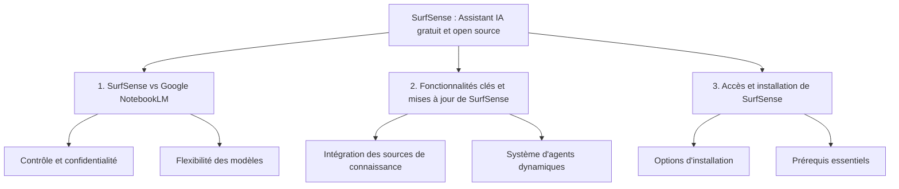

# Présentation du RAG open source SurfSense

- Canonical URL: https://leandeep.com/pr%C3%A9sentation-du-rag-open-source-surfsense/
- Author: Olivier Eeckhoutte
- Published: 2026-05-07T19:15:00Z
- Updated: 2026-05-07T19:15:00Z
- Language: fr
- Tags: Machine Learning, AI
- License: CC BY-NC 4.0 (https://creativecommons.org/licenses/by-nc/4.0/)




<br/>

## SurfSense vs Google NotebookLM

### Le besoin d'une alternative open source

Bien que Google NotebookLM soit populaire pour l'interaction avec les documents, l'outil open source **SurfSense** offre un plus grand contrôle, une personnalisation accrue et une confidentialité des données supérieure.

**Limites de Google NotebookLM**
   - NotebookLM est populaire pour chatter avec des documents, créer des podcasts et accélérer la recherche.
   - Problème majeur: pas de personnalisation, car l'utilisateur ne possède pas l'outil.
   - Lié exclusivement à l'IA de Google, sans possibilité de changer de modèles ou d'exécuter localement.
   - Toutes les données passent par les serveurs Google.

**Présentation de SurfSense**
   - C'est un assistant de recherche IA gratuit et open source pour chatter avec ses propres connaissances.
   - Surpasse NotebookLM dans sa fonction principale et se connecte à tout ce que l'utilisateur utilise déjà.
   - Avantage clé: l'utilisateur possède toutes ses données et peut l'exécuter sur son ordinateur.
   - Connexion à n'importe quel modèle IA: OpenAI, Claude, ou locaux via Ollama.

<br/>

### Avantages principaux de SurfSense sur NotebookLM

SurfSense offre une confidentialité supérieure, un contrôle des coûts, une flexibilité des modèles et des intégrations par rapport à l'écosystème fermé de Google NotebookLM. 

**Open source vs fermé**
   - Code public: inspection, amélioration, ajout de fonctionnalités
   - NotebookLM est une "boîte noire"

**Accès personnalisable aux modèles IA**
   - +100 modèles IA: GPT-4, Claude, locaux via Ollama
   - Choix du bon outil pour chaque tâche (code, recherche, créativité)

**Intégrations et confidentialité supérieures**
   - Connexions à Slack, GitHub, Notion, YouTube
   - Centralise les connaissances dispersées
   - Self-hosted: documents internes ne quittent jamais le serveur


<br/>

### Fonctionnalités clés et mises à jour

**Intégration complète des connaissances et recherche**

SurfSense se connecte à de nombreuses sources et utilise une recherche hybride puissante pour trouver et citer rapidement les informations.

**Connexion à toutes les sources**
   - Slack, Notion, GitHub, Discord, Gmail, Google Drive, YouTube, Jira, etc.
   - Questions en langage naturel, réponses de toutes les sources simultanément

**Recherche hybride**
   - Combinaison similarité sémantique + full text search
   - Citations systématiques des sources


<br/>

### Système d'agents dynamiques et croissance communautaire

L'architecture d'agents dynamiques détermine la meilleure réponse, y compris podcasts, et l'open source favorise un développement rapide.

1. **Architecture d'agents dynamiques**
   - Décide la meilleure réponse: résumé, citations, raffinage, podcasts TTS
   - Contrôle voix/format, contrairement à Google

2. **Communauté open source**
   - Ajouts de connecteurs par la communauté


<br/>

### Quick test

```
curl -fsSL https://raw.githubusercontent.com/MODSetter/SurfSense/main/docker/scripts/install.sh | bash
```

Add the following env vars in .env if you are running your instance on a remote machine in your LAN:
```
NEXT_FRONTEND_URL=http://192.168.1.100:3929

BACKEND_URL=http://192.168.1.100:8929
NEXT_PUBLIC_FASTAPI_BACKEND_URL=http://192.168.1.100:8929

NEXT_PUBLIC_ZERO_CACHE_URL=ws://192.168.1.100:5929

OPENAI_API_BASE=http://192.168.1.234:1234/v1
OPENAI_API_KEY=lm-studio

# optional
LLM_PROVIDER=openai
```

```
cd surfsense
docker compose down
# stop the auto updater
docker stop watchtower
docker system prune -a # Attention impactant
docker compose up -d

# debug
docker exec -it $(docker ps | grep frontend | awk '{print $1}') sh
grep -R "localhost:5929" .
```
