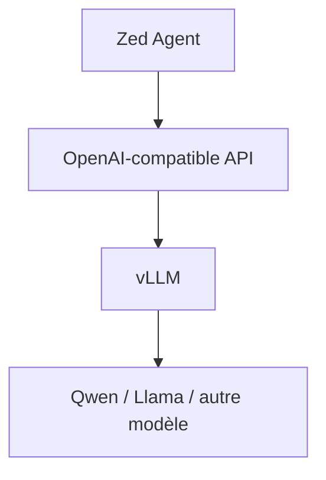

# Zed + vLLM on DGX Spark

- Canonical URL: https://leandeep.com/zed--vllm-on-dgx-spark/
- Author: Olivier Eeckhoutte
- Published: 2026-07-01T05:23:00Z
- Updated: 2026-07-01T05:23:00Z
- Language: fr
- Tags: LLM, AI, Machine Learning
- License: CC BY-NC 4.0 (https://creativecommons.org/licenses/by-nc/4.0/)


Dans cet article, je partage mes notes sur l'utilisation de `Zed` sur OSX avec comme AI provider `vLLM`, `Qwen 3.6` sur un `Nvidia DGX spark` distant privé. Mon objectif est d'avoir l'équivalent d'un petit `Cursor` (remplacé par `Zed`) avec un LLM local.
Je suis en train de mettre en place un Agent qui travaille pour moi tout le temps et qui répond à toutes mes questions (via texte ou voix). Je veux pouvoir cramer autant de tokens que je veux et ne rien avoir à payer car étant très très geek, j'ai une consommation en tokens stratosphérique (malgré le fait que je code depuis depuis que j'ai l'âge de 13 ou 14 ans).

> Je dis "petit" Cursor car au niveau des performances, j'ai l'impression qu'on est pas encore au niveau de Cursor. Je viens de démarrer l'expérimentation, au moment où j'écris cet article, j'ai déjà passé pas mal de temps à tester des outils et tweaker. Actuellement les perfs sont `Engine 000: Avg prompt throughput: 4912.0 tokens/s, Avg generation throughput: 11.9 tokens/s,`; ce qui dans les faits donne une vraie impression de vitesse. Moi qui utilise `Cursor` intensivement, j'ai l'impression qu'on est pas encore à son niveau. Il faudrait que j'essaye avec une énorme codebase... (Après je suis peut-être très exigent).

<br/>

Voici le setup:



<br/>

## Installation de vLLM

Simple via Docker:

```
docker pull ghcr.io/aeon-7/aeon-vllm-ultimate:latest

docker run --rm -it \
 --entrypoint vllm \
 --ipc host --gpus all \
 -v ~/.cache/huggingface:/root/.cache/huggingface \
 -p 8000:8000 \
 -e FLASHINFER_DISABLE_VERSION_CHECK=1 \
 -e CUTE_DSL_ARCH=sm_121a \
 ghcr.io/aeon-7/aeon-vllm-ultimate:latest \
 serve \
 --model nvidia/Qwen3.6-35B-A3B-NVFP4 \
 --host 0.0.0.0 --port 8000 \
 --trust-remote-code \
 --quantization modelopt \
 --kv-cache-dtype fp8 \
 --attention-config '{"backend": "TRITON_ATTN"}' \
 --gpu-memory-utilization 0.85 \
 --max-model-len 262144 \
 --default-chat-template-kwargs '{"enable_thinking": false}' \
 --enable-auto-tool-choice \
 --tool-call-parser qwen3_coder
```

<br/>

Avec ces paramètres, on est tout juste à la limite du Spark:


> `--max-model-len 131072` # 128K — bon compromis agent/coding<br/>
> `--max-model-len 262144` # 262K — natif, plus gourmand en mémoire

En cas de OOM au démarrage ou à l’inférence, baisser --gpu-memory-utilization (ex. 0.80 au lieu de 0.85)

<br/>

## Configuration de Zed

Pour connecter `Zed` à son LLM local, il faut configurer l'outil via son fichier de configuration `vim ~/.config/zed/settings.json`.

Example dans notre cas:

```json
...
"language_models": {
  "openai_compatible": {
    "vllm": {
      "api_url": "http://IP:8000/v1",
      "available_models": [
      {
        "name": "nvidia/Qwen3.6-35B-A3B-NVFP4",
        "display_name": "Qwen3.6 35B",
        "max_tokens": 262144,
        "max_output_tokens": 8192,
        "capabilities": {
          "tools": true,
          "images": false,
          "parallel_tool_calls": false,
          "prompt_cache_key": false,
          "interleaved_reasoning": false,
          "max_tokens_parameter": true,
        },
      },
      ],
    },
  },
},
"agent": {
  "default_model": {
    "provider": "vllm",
    "model": "nvidia/Qwen3.6-35B-A3B-NVFP4",
  },
  "default_profile": "write",
},
...

```

> Attention à bien aligner `max_tokens` dans les `settings.json` sur la même valeur (ex. 65536 ou 131072, ou `262144`) que celle définie dans `docker run`, sinon Zed peut croire que le contexte est plus petit que ce que vLLM accepte réellement.

<br/>

Le mode thinking n'est pas activé par défaut sur le serveur.

C’est ce flag qui le coupe: `--default-chat-template-kwargs '{"enable_thinking": false}'`

Il est possible de réactiver le thinking par requête. En effet, même avec thinking OFF au serveur, une requête peut le réactiver. Il suffit d'utiliser le paramètre `"chat_template_kwargs": {"enable_thinking": true}`:

Example:

```
curl http://IP:8000/v1/chat/completions \
 -H "Content-Type: application/json" \
 -d '{
"model": "nvidia/Qwen3.6-35B-A3B-NVFP4",
"messages": [{"role": "user", "content": "Bonjour, réponds en une phrase."}],
"max_tokens": 256,
"chat_template_kwargs": {"enable_thinking": true}
}'

```

<br/>

## Testing

```
curl http://IP:8000/v1/completions \
 -H "Content-Type: application/json" \
 -d '{
"model": "nvidia/Qwen3.6-35B-A3B-NVFP4",
"prompt": "The capital of France is",
"max_tokens": 20,
"temperature": 0
}'

```

Output:

```
{"id":"cmpl-883ad746dc33d898","object":"text_completion","created":1782943374,"model":"nvidia/Qwen3.6-35B-A3B-NVFP4","choices":[{"index":0,"text":" Paris, a city renowned for its iconic landmarks such as the Eiffel Tower, the Louvre Museum","logprobs":null,"finish_reason":"length","stop_reason":null,"token_ids":null,"prompt_logprobs":null,"prompt_token_ids":null,"routed_experts":null}],"service_tier":null,"system_fingerprint":"vllm-0.23.0+aeon.sm121a.dflash-f563a164","usage":{"prompt_tokens":5,"total_tokens":25,"completion_tokens":20,"prompt_tokens_details":null},"kv_transfer_params":null}%

```

<br/>

## Skills

Pour ajouter des skills, il suffit soit d'ajouter les skills ici:

```
mkdir -p ~/.agents/skills
cp -R all_skills ~/.agents/skills/
```

```
tree .agents/skills/

.agents/skills/
├── blabla-and-blabla-design
│   └── SKILL.md
├── ...
│   └── SKILL.md
```

<br/>

ou soit d'ajouter via Zed

- Ouvrir la Command Palette (Cmd+Shift+P)
- -> create skill from url
- Coller l'URL (ou laisse Zed utiliser celle du presse-papiers)
  <br/>Exemple: `https://github.com/.../blob/main/skills/blabla-and-blabla-design/SKILL.md`
- Sauvegarde le skill (Global ou Project).

